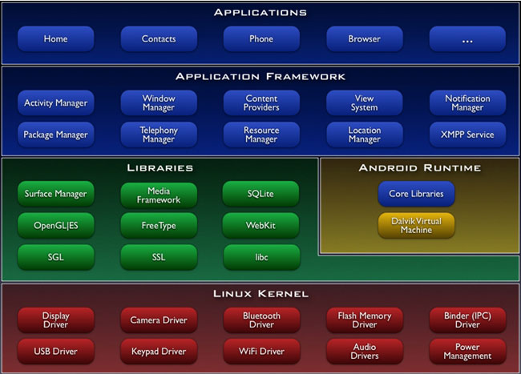
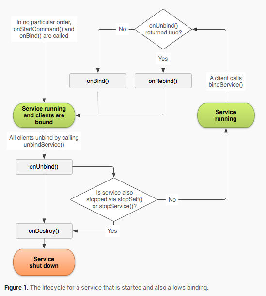
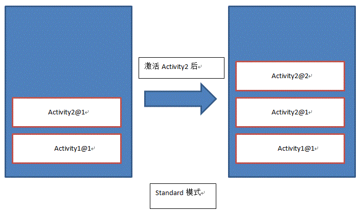
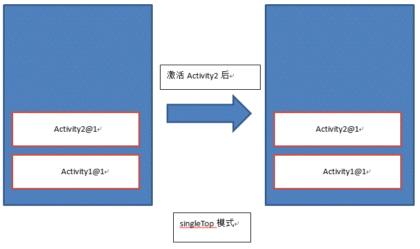
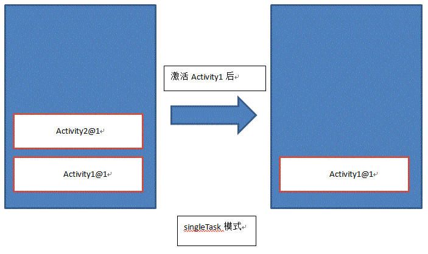
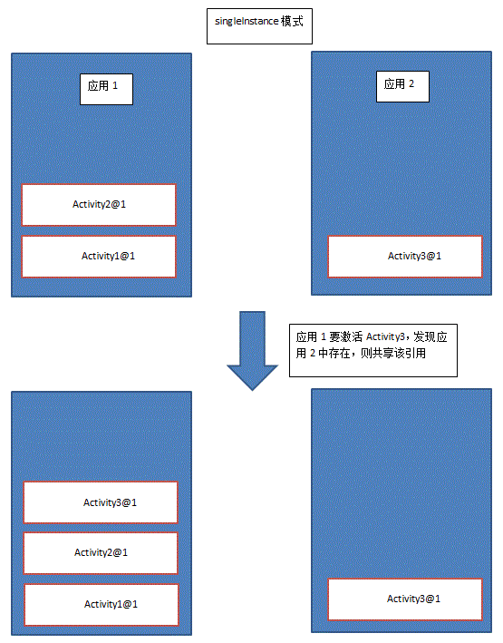

# Android

## Android 系统架构

总的来说，Android的系统体系结构分为四层，自顶向下分别是：

+ 应用程序(Applications)
+ 应用程序框架(Application Frameworks)
+ 系统运行库与Android运行环境(Libraris & Android Runtime)
+ Linux内核(Linux Kernel)


安卓系统结构示意图



### 应用程序(Applications)

Android会同一系列核心应用程序包一起发布，该应用程序包包括email客户端，SMS短消息程序，日历，地图，浏览器，联系人管理程序等。所有的应用程序都是使用JAVA语言编写的。通常开发人员就处在这一层。

### 应用程序框架(Application Frameworks)

提供应用程序开发的各种API进行快速开发，也即隐藏在每个应用后面的是一系列的服务和系统，大部分使用Java编写，所谓官方源码很多也就是看这里，其中包括：

+ 丰富而又可扩展的视图（Views），可以用来构建应用程序， 它包括列表（lists），网格（grids），文本框（text boxes），按钮（buttons）， 甚至可嵌入的web浏览器。
+ 内容提供器（Content Providers）使得应用程序可以访问另一个应用程序的数据（如联系人数据库）， 或者共享它们自己的数据
+ 资源管理器（Resource Manager）提供 非代码资源的访问，如本地字符串，图形，和布局文件（ layout files ）。
+ 通知管理器 （Notification Manager） 使得应用程序可以在状态栏中显示自定义的提示信息。
+ 活动管理器（ Activity Manager） 用来管理应用程序生命周期并提供常用的导航回退功能。

### 系统运行库与Android运行环境(Libraris & Android Runtime)

**1) 系统运行库**

Android 包含一些C/C++库，这些库能被Android系统中不同的组件使用。它们通过 Android 应用程序框架为开发者提供服务。以下是一些核心库：

+ Bionic系统 C 库 - 一个从 BSD 继承来的标准 C 系统函数库（ libc ）， 它是专门为基于 embedded linux 的设备定制的。
+ 媒体库 - 基于 PacketVideo OpenCORE；该库支持多种常用的音频、视频格式回放和录制，同时支持静态图像文件。编码格式包括MPEG4, H.264, MP3, AAC, AMR, JPG, PNG 。
+ Surface Manager - 对显示子系统的管理，并且为多个应用程序提 供了2D和3D图层的无缝融合。这部分代码
+ Webkit,LibWebCore - 一个最新的web浏览器引擎用，支持Android浏览器和一个可嵌入的web视图。鼎鼎大名的 Apple Safari背后的引擎就是Webkit
+ SGL - 底层的2D图形引擎
+ 3D libraries - 基于OpenGL ES 1.0 APIs实现；该库可以使用硬件 3D加速（如果可用）或者使用高度优化的3D软加速。
+ FreeType -位图（bitmap）和矢量（vector）字体显示。
+ SQLite - 一个对于所有应用程序可用，功能强劲的轻型关系型数据库引擎。
+ 还有部分上面没有显示出来的就是硬件抽象层。其实Android并非讲所有的设备驱动都放在linux内核里面，而是实现在userspace空间，这么做的主要原因是GPL协议，Linux是遵循该 协议来发布的，也就意味着对 linux内核的任何修改，都必须发布其源代码。而现在这么做就可以避开而无需发布其源代码，毕竟它是用来赚钱的。 而 在linux内核中为这些userspace驱动代码开一个后门，就可以让本来userspace驱动不可以直接控制的硬件可以被访问。而只需要公布这个 后门代码即可。一般情况下如果要将Android移植到其他硬件去运行，只需要实现这部分代码即可。包括：显示器驱动，声音，相机，GPS,GSM等等

**2) Android运行环境**

该核心库提供了JAVA编程语言核心库的大多数功能。

每一个Android应用程序都在它自己的进程中运 行，都拥有一个独立的Dalvik虚拟 机实例。Dalvik被设计成一个设备可以同时高效地运行多个虚拟系统。 Dalvik虚拟机执行（.dex）的Dalvik可执行文件，该格式文件针对小内存使用做了 优化。同时虚拟机是基于寄存器的，所有的类都经由JAVA编译器编译，然后通过SDK中 的 "dx" 工具转化成.dex格式由虚拟机执行。

### Linux内核(Linux Kernel)

Android的核心系统服务依赖于Linux 2.6 内核，如安全性，内存管理，进程管理， 网络协议栈和驱动模型。 Linux 内核也同时作为硬件和软件栈之间的抽象层。其外还对其做了部分修改，主要涉及两部分修改：

1. Binder (IPC)：提供有效的进程间通信，虽然linux内核本身已经提供了这些功能，但Android系统很多服务都需要用到该功能，为了某种原因其实现了自己的一套。
2. 电源管理：主要是为了省电，毕竟是手持设备嘛，低耗电才是我们的追求。

## Activity/Service 生命周期

了解Activity的生命周期，需要了解：

1. 四种状态
2. 七个重要方法
3. 三个嵌套循环
4. 其他

首先在开头放出生命周期的一张总图：


### 四种状态

四种状态包括

+ 活动（Active/Running）状态
+ 暂停(Paused)状态
+ 停止(Stopped)状态
+ 非活动（Dead）状态

#### 活动（Active/Running）状态

当Activity运行在屏幕前台(处于当前任务活动栈的最上面),此时它获取了焦点能响应用户的操作,属于运行状态，同一个时刻只会有一个Activity 处于活动(Active)或运行(Running)状态。

此状态由onResume()进入，由onPause()退出

#### 暂停(Paused)状态

当Activity失去焦点但仍对用户可见(如在它之上有另一个透明的Activity或Toast、AlertDialog等弹出窗口时)它处于暂停状态。暂停的Activity仍然是存活状态(它保留着所有的状态和成员信息并保持和窗口管理器的连接),但是当系统内存极小时可以被系统杀掉。

此状态由onPause()进入，可能下一步进入onResume()或者onCreate()重新唤醒软件，或者被onStop()杀掉

#### 停止(Stopped)状态

完全被另一个Activity遮挡时处于停止状态,它仍然保留着所有的状态和成员信息。只是对用户不可见,当其他地方需要内存时它往往被系统杀掉。

该状态由onStop()进入，如果被杀掉，可能进入onCreate()或onRestart()，如果彻底死亡，进入onDestroy()

### Service生命周期

Service有两种启动方式:

+ startService() 启动本地服务Local Service
+ bindService() 启动远程服务Remote Service

远程服务允许暴露接口并让系统内不同程序相互注册调用。Local Service无法抵抗一些系统清理程序如MIUI自带的内存清除。

具体如何防止自己的Service被杀死可以看这个博客[Android开发之如何保证Service不被杀掉（broadcast+system/app）](http://blog.csdn.net/mad1989/article/details/22492519)，已经做到很变态的程度了。此外今天看到如何看待 MIUI 工程师袁军对 QQ 后台机制的评论？，QQ的开启一个像素在前台的做法真的是…呵呵

两种不同的启动方式决定了Service具有两种生命周期的可能（并非互斥的两种）。概括来说，Service在被创建之后都会进入回调onCreate()方法，随后根据启动方式分别回调onStartCommand()方法和onBind()方法。如果Service是经由bindService()启动，则需要所有client全部调用unbindService()才能将Service释放等待系统回收。

一张图解释：


回调方法的结构下图解释的很明白：



## Activity 的 4 种启动模式

对安卓而言，Activity有四种启动模式，它们是：

+ standard 标准模式，每次都新建一个实例对象
+ singleTop 如果在任务栈顶发现了相同的实例则重用，否则新建并压入栈顶
+ singleTask 如果在任务栈中发现了相同的实例，将其上面的任务终止并移除，重用该实例。否则新建实例并入栈
+ singleInstance 允许不同应用，进程线程等共用一个实例，无论从何应用调用该实例都重用

想要感受一下的话写一个小demo，然后自己启动自己再点返回键就看出来了。下面详细说说每一种启动模式

### standard

一张图就很好理解



什么配置都不写的话就是这种启动模式。但是每次都新建一个实例的话真是过于浪费，为了优化应该尽量考虑余下三种方式。

### singleTop

每次扫描栈顶，如果在任务栈顶发现了相同的实例则重用，否则新建并压入栈顶。



配制方法实在Mainifest.xml中进行：

    <activity
        android:name=".SingleTopActivity"
        android:label="@string/singletop"
        android:launchMode="singleTop" >
    </activity>

### singleTask

与singleTop的区别是singleTask会扫描整个任务栈并制定策略。上效果图：



使用时需要小心因为会将之前入栈的实例之上的实例全部移除，需要格外小心逻辑。

配制方法：

    <activity
        android:name=".SingleTopActivity"
        android:label="@string/singletop"
        android:launchMode="singleTop" >
    </activity>

### singleInstance

这个的理解可以这么看：在微信里点击“用浏览器打开”一个朋友圈，然后切到QQ再用浏览器开一个网页，再跑到哪里再开一个页面。每次我们都在Activity中试图启动另一个浏览器Activity，但是在浏览器端看来，都是调用了同一个自己。因为使用了singleInstance模式，不同应用调用的Activity实际上是共享的。

上说明图：



配制方法：

    <activity
        android:name=".SingleTopActivity"
        android:label="@string/singletop"
        android:launchMode="singleTop" >
    </activity>

## ListView 原理与优化

ListView的实现离不开Adapter。可以这么理解：ListView中给出了数据来的时候，View如何实现的具体方式，相当于MVC中的V；而Adapter提供了相当于MVC中的C，指挥了ListView的数据加载等行为。

提一个问题：假设ListView中有10W个条项，那内存中会缓存10W个吗？答案当然是否定的。那么是如何实现的呢？下面这张图可以清晰地解释其中的原理:


可以看到当一个View移出可视区域的时候，设为View1，它会被标记Recycle，然后可能：

+ 新进入的View2与View1类型相同，那么在getView方法传入的convertView就不是null而就是View1。换句话说，View1被重用了
+ 新进入的View2与View1类型不同，那么getView传入的convertView就是null，这是需要new一个View。当内存紧张时，View1就会被GC

### ListView的优化(以异步加载Bitmap优化为例)

首先概括的说ListView优化分为三级缓存:

+ 内存缓存
+ 文件缓存
+ 网络读取

简要概括就是在getView中，如果加载过一个图片，放入Map类型的一个MemoryCache中(示例代码使用的是Collections.synchronizedMap(new LinkedHashMap(10, 1.5f, true))来维护一个试用LRU的堆)。如果这里获取不到，根据View被Recycle之前放入的TAG中记录的uri从文件系统中读取文件缓存。如果本地都找不到，再去网络中异步加载。

这里有几个注意的优化点：

1. 从文件系统中加载图片也没有内存中加载那么快，甚至可能内存中加载也不够快。因此在ListView中应设立busy标志位，当ListView滚动时busy设为true，停止各个view的图片加载。否则可能会让UI不够流畅用户体验度降低。
2. 文件加载图片放在子线程实现，否则快速滑动屏幕会卡
3. 开启网络访问等耗时操作需要开启新线程，应使用线程池避免资源浪费，最起码也要用AsyncTask。
4. Bitmap从网络下载下来最好先放到文件系统中缓存。这样一是方便下一次加载根据本地uri直接找到，二是如果Bitmap过大，从本地缓存可以方便的使用Option.inSampleSize配合Bitmap.decodeFile(ui, options)或Bitmap.createScaledBitmap来进行内存压缩

原博文有非常好的代码示例: [Listview异步加载图片之优化篇（有图有码有解释）](http://blog.chinaunix.net/uid-29134536-id-4094813.html)非常值得看看。

此外Github上也有仓库：https://github.com/geniusgithub/SyncLoaderBitmapDemo

## Thread, Loop, Handler

Android中的Thread, Looper和Handler机制(附带HandlerThread与AsyncTask)

### 关系

与Windows系统一样，Android也是消息驱动型的系统。引用一下消息驱动机制的四要素：

+ 接收消息的“消息队列”
+ 阻塞式地从消息队列中接收消息并进行处理的“线程”
+ 可发送的“消息的格式”
+ “消息发送函数”

与之对应，Android中的实现对应了

+ 接收消息的“消息队列” ——【MessageQueue】
+ 阻塞式地从消息队列中接收消息并进行处理的“线程” ——【Thread+Looper】
+ 可发送的“消息的格式” ——【Message】
+ “消息发送函数”——【Handler的post和sendMessage】

一个Looper类似一个消息泵。它本身是一个死循环，不断地从MessageQueue中提取Message或者Runnable。而Handler可以看做是一个Looper的暴露接口，向外部暴露一些事件，并暴露sendMessage()和post()函数。

在安卓中，除了UI线程/主线程以外，普通的线程(先不提HandlerThread)是不自带Looper的。想要通过UI线程与子线程通信需要在子线程内自己实现一个Looper。开启Looper分三步走：

1. 判定是否已有Looper并Looper.prepare()
2. 做一些准备工作(如暴露handler等)
3. 调用Looper.loop()，线程进入阻塞态

由于每一个线程内最多只可以有一个Looper，所以一定要在Looper.prepare()之前做好判定，否则会抛出java.lang.RuntimeException: Only one Looper may be created per thread。为了获取Looper的信息可以使用两个方法：

+ Looper.myLooper()
+ Looper.getMainLooper()

Looper.myLooper()获取当前线程绑定的Looper，如果没有返回null。Looper.getMainLooper()返回主线程的Looper,这样就可以方便的与主线程通信。注意：在Thread的构造函数中调用Looper.myLooper只会得到主线程的Looper，因为此时新线程还未构造好

下面给一段代码，通过Thread，Looper和Handler实现线程通信：


**MainActivity.java**

```
public class MainActivity extends Activity {
    public static final String TAG = "Main Acticity";
    Button btn = null;
    Button btn2 = null;
    Handler handler = null;
    MyHandlerThread mHandlerThread = null;

    @Override
    protected void onCreate(Bundle savedInstanceState) {
        super.onCreate(savedInstanceState);
        setContentView(R.layout.activity_main);
        btn = (Button)findViewById(R.id.button);
        btn2 = (Button)findViewById(R.id.button2);
        Log.d("MainActivity.myLooper()", Looper.myLooper().toString());
        Log.d("MainActivity.MainLooper", Looper.getMainLooper().toString());


        btn.setOnClickListener(new View.OnClickListener() {
            @Override
            public void onClick(View view) {
                mHandlerThread = new MyHandlerThread("onStartHandlerThread");
                Log.d(TAG, "创建myHandlerThread对象");
                mHandlerThread.start();
                Log.d(TAG, "start一个Thread");
            }
        });

        btn2.setOnClickListener(new View.OnClickListener() {
            @Override
            public void onClick(View view) {
                if(mHandlerThread.mHandler != null){
                    Message msg = new Message();
                    msg.what = 1;
                    mHandlerThread.mHandler.sendMessage(msg);
                }

            }
        });
    }
}
```

**MyHandlerThread.java**

```
public class MyHandlerThread extends Thread {
    public static final String TAG = "MyHT";

    public Handler mHandler = null;

    @Override
    public void run() {
        Log.d(TAG, "进入Thread的run");
        Looper.prepare();
        Looper.prepare();
        mHandler = new Handler(Looper.myLooper()){
            @Override
            public void handleMessage(Message msg){
                Log.d(TAG, "获得了message");
                super.handleMessage(msg);
            }
        };
        Looper.loop();
    }
}
```

### HandlerThread

Android为了方便对Thread和Handler进行封装，也就是HandlerThread。文档中对HandlerThread的定义是：

> Handy class for starting a new thread that has a looper. The looper can then be used to create handler classes. Note that start() must still be called.

HandlerThread继承自Thread，说白了就是Thread加上一个一个Looper。分析下面的代码:

```
public class MyHandlerThread extends HandlerThread{
    @Override
    public void run(){
        if(Looper.myLooper == null){
            Looper.prepare();
        }
        super.run();
    }
}
```

会抛出java.lang.RuntimeException: Only one Looper may be created per thread错误。如果我们把super.run()注释掉就不会有这样的错误。显然在super.run()中进行了Looper的绑定。

### AsyncTask

AsyncTask是谷歌对Thread和Handler的进一步封装，完全隐藏起了这两个概念，而用doInBackground(Params... params)取而代之。但需要注意的是AsyncTask的效率不是很高而且资源代价也比较重，只有当进行一些小型操作时为了方便起见使用。这一点在官方文档写的很清楚:

> AsyncTask is designed to be a helper class around Thread and Handler and does not constitute a generic threading framework. AsyncTasks should ideally be used for short operations (a few seconds at the most.) If you need to keep threads running for long periods of time, it is highly recommended you use the various APIs provided by the java.util.concurrent package such as Executor, ThreadPoolExecutor and FutureTask.

由于使用比较简单应该不需要细说。如有需要会在未来更新。

## 面试问题

1. 什么是ANR，如何避免
1. [[ListView原理与优化|ListView-Optimize]]
1. ContentProvider实现原理
1. 介绍Binder机制
1. 匿名共享内存，使用场景
1. 如何自定义View，如果要实现一个转盘圆形的View，需要重写View中的哪些方法？(onLayout,onMeasure,onDraw)
1. Android事件分发机制
1. Socket和LocalSocket
1. [[如何加载大图片|Android-Large-Image]]
1. HttpClient和URLConnection的区别，怎么使用https
1. Parcelable和Serializable区别
1. Android里跨进程传递数据的几种方案。(Binder,文件[面试官说这个不算],Socket,匿名共享内存（Anonymous Shared Memory))
1. 布局文件中，layout_gravity 和 gravity 以及 weight的作用。
1. ListView里的ViewType机制
1. TextView怎么改变局部颜色(SpannableString或者HTML)
1. Activity A 跳转到 Activity B，生命周期的执行过程是啥？(此处有坑 ActivityA的OnPause和ActivityB的onResume谁先执行)
1. Android中Handler声明非静态对象会发出警告，为什么，非得是静态的？(Memory Leak)
1. ListView使用过程中是否可以调用addView(不能，话说这题考来干啥。。。)
1. [[Android中的Thread, Looper和Handler机制(附带HandlerThread与AsyncTask)|Android-handler-thread-looper]]
1. Application类的作用
1. View的绘制过程
1. 广播注册后不解除注册会有什么问题？(内存泄露)
1. 属性动画(Property Animation)和补间动画(Tween Animation)的区别，为什么在3.0之后引入属性动画(官方解释：调用简单)
1. 有没有使用过EventBus或者Otto框架，主要用来解决什么问题，内部原理
1. 设计一个网络请求框架(可以参考Volley框架)
1. 网络图片加载框架(可以参考BitmapFun)
1. Android里的LRU算法原理
1. BrocastReceive里面可不可以执行耗时操作?
1. Service onBindService 和startService 启动的区别
