# 动态规划

## 动态规划初探

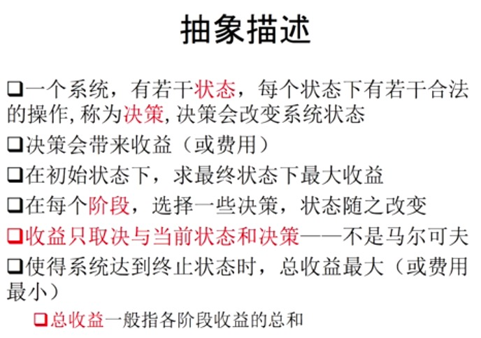

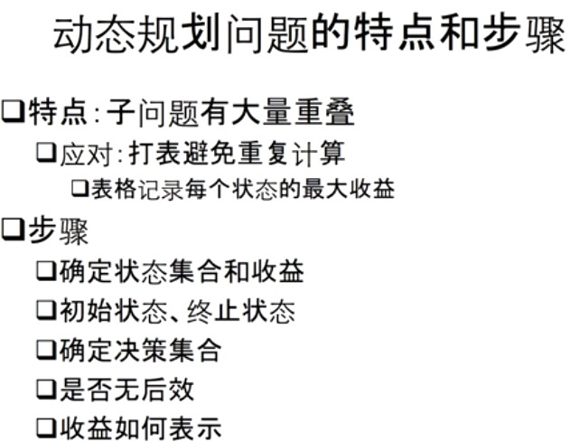

### 精选例题：最长单增子序列 LIS

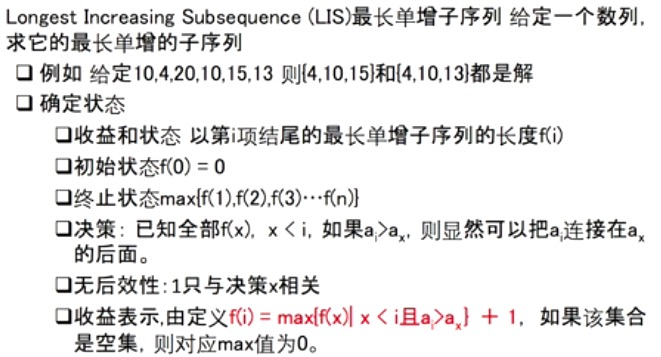

### 精选例题：旅行商问题 TSP

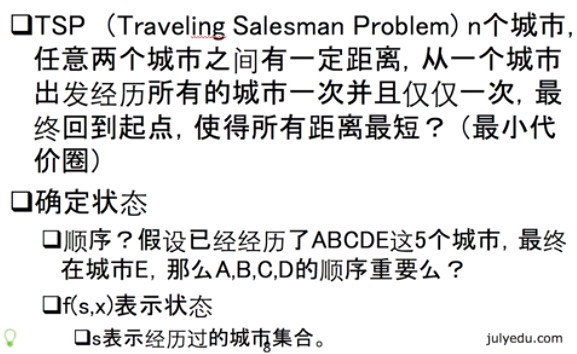

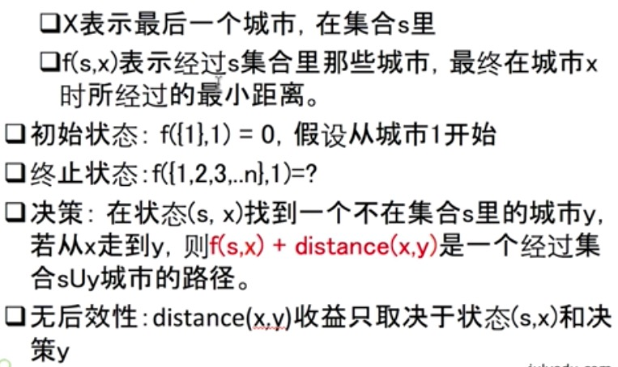

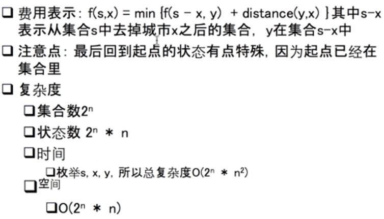

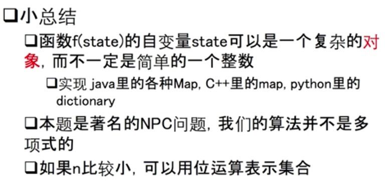

### 简述例题：换硬币

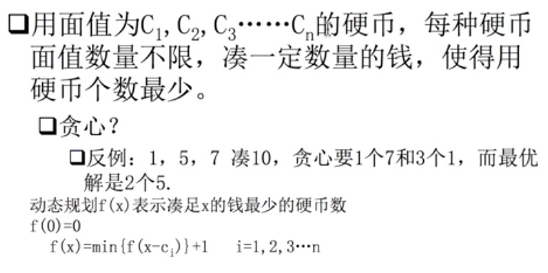

### 简述例题：矩阵连乘最优加括号方式

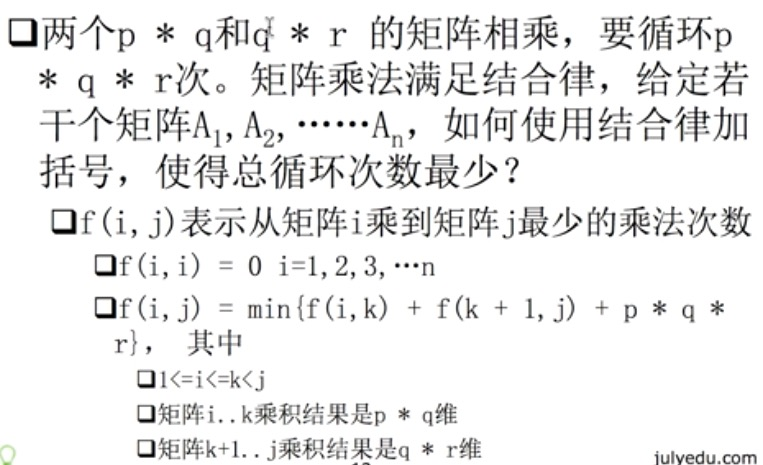

### 小总结

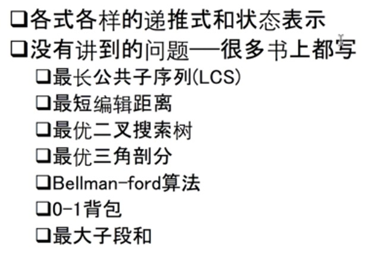

### 总结

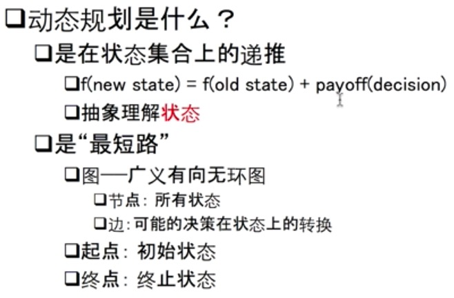

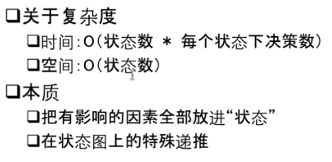

### 提升

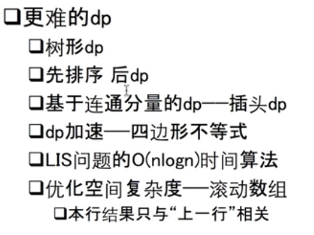

## 动态规划实战

### 例1 二维数组路径最小和

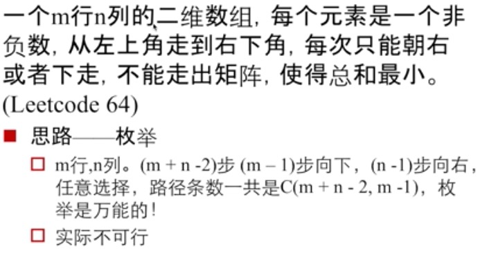

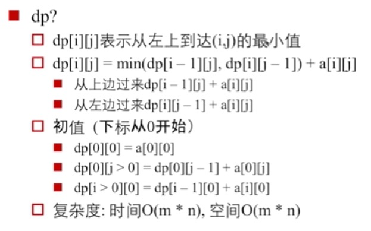

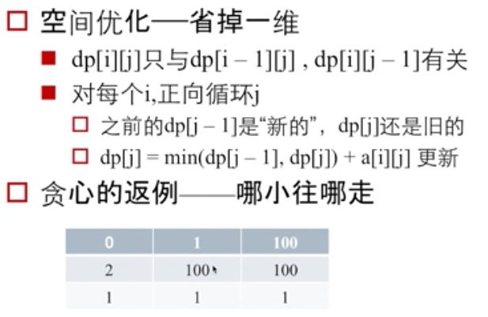

### 例2 最大子数组和

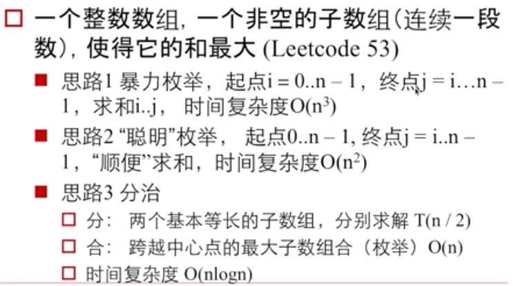

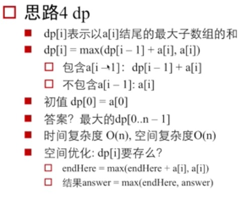

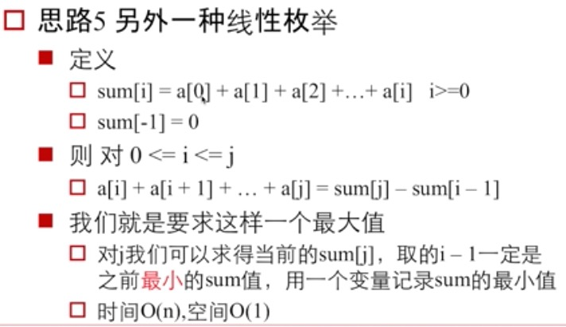

## 例3 编辑距离

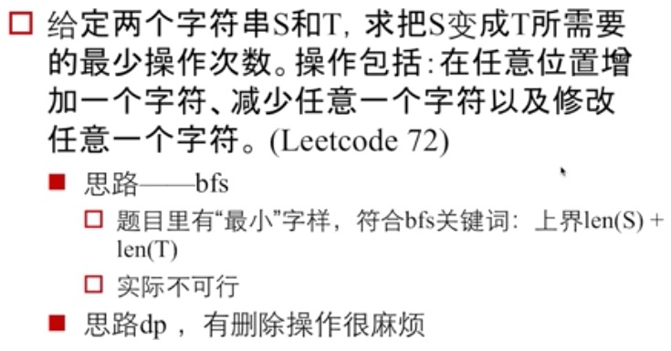

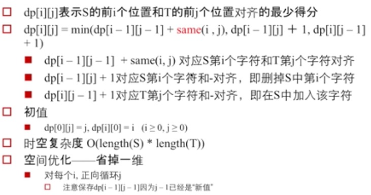