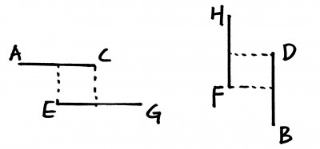

# Rectangle Area

Find the total area covered by two rectilinear rectangles in a 2D plane.

Each rectangle is defined by its bottom left corner and top right corner as shown in the figure.


Rectangle Area

Assume that the total area is never beyond the maximum possible value of int.

## Solution

This problem can be converted as a overlap internal problem. On the x-axis, there are (A,C) and (E,G); on the y-axis, there are (F,H) and (B,D). If they do not have overlap, the total area is the sum of 2 rectangle areas. If they have overlap, the total area should minus the overlap area.



```java
public class Solution {
    public int computeArea(int A, int B, int C, int D, int E, int F, int G, int H) {
        if(C<E||G<A )
        return (G-E)*(H-F) + (C-A)*(D-B);
 
        if(D<F || H<B)
            return (G-E)*(H-F) + (C-A)*(D-B);
     
        int right = Math.min(C,G);
        int left = Math.max(A,E);
        int top = Math.min(H,D);
        int bottom = Math.max(F,B);
     
        return (G-E)*(H-F) + (C-A)*(D-B) - (right-left)*(top-bottom);
    }
}
```