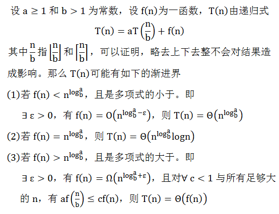
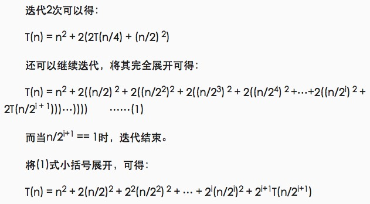
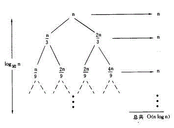
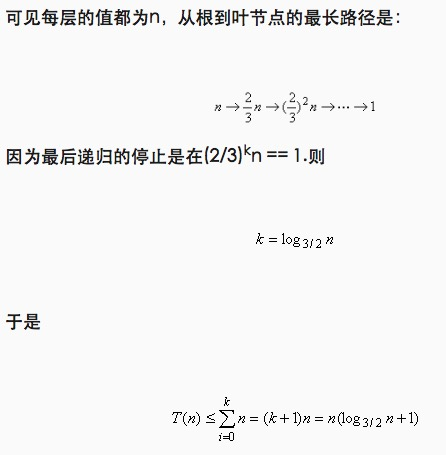
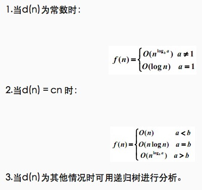

# 时间复杂度

## 程序分析法则

+ 对于一些简单的输入输出语句或赋值语句,近似认为需要O(1)时间
+ 对于顺序结构,需要依次执行一系列语句所用的时间可采用大O下"求和法则"
    + 求和法则:是指若算法的2个部分时间复杂度分别为 T1(n)=O(f(n))和 T2(n)=O(g(n)),则 T1(n)+T2(n)=O(max(f(n), g(n)))
    + 特别地,若T1(m)=O(f(m)), T2(n)=O(g(n)),则 T1(m)+T2(n)=O(f(m) + g(n))
+ 对于选择结构,如if语句,它的主要时间耗费是在执行then字句或else字句所用的时间,需注意的是检验条件也需要O(1)时间
+ 对于循环结构,循环语句的运行时间主要体现在多次迭代中执行循环体以及检验循环条件的时间耗费,一般可用大O下"乘法法则"
    + 乘法法则: 是指若算法的2个部分时间复杂度分别为 T1(n)=O(f(n))和 T2(n)=O(g(n)),则 `T1*T2=O(f(n)*g(n))`
+ 对于复杂的算法,可以将它分成几个容易估算的部分,然后利用求和法则和乘法法则技术整个算法的时间复杂度
    + 若g(n)=O(f(n)),则O(f(n))+ O(g(n))= O(f(n))
    + O(Cf(n)) = O(f(n)),其中C是一个正常数

## 递归

递归调用树，一般是等差或等比级数

    T(n) = T(n/4) + T(n/2) + cn^2

    T(n) = c(n^2 + 5(n^2)/16 + 25(n^2)/256) + ….

上述系列是几何级数为5/16。

为得到一个上限,我们求无穷级数的和： (n^2)/(1 – 5/16) 即为 O(n^2)

## 主定理

主定理是解决递归的一种直接方法。但仅用于一些类型或可以转换为以下类型的递归公式：

    T(n) = aT(n/b) + f(n)  （a >= 1 且 b > 1）



## 一些例子

```
decimal Calculation(int n)
{
    decimal result = 0;
    for (int i = 0; i < (1 << n); i++)
    result += i;
    return result;
}
```

这里，给定规模 n，则基本步骤的执行数量为 2n，所以算法复杂度为 O(2n)。

---

斐波那契数列：

+ Fib(0) = 0
+ Fib(1) = 1
+ Fib(n) = Fib(n-1) + Fib(n-2)

F() = 0, 1, 1, 2, 3, 5, 8, 13, 21, 34 ...

```
int Fibonacci(int n)
{
    if (n <= 1)
        return n;
    else
        return Fibonacci(n - 1) + Fibonacci(n - 2);
}
```

通过使用递归树的结构描述可知算法复杂度为 O(2^n)。

## 一个比较完整的例子

T(n) = 2T(n/2) + n^2



这恰好是一个树形结构，由此可引出递归树法。
每一节点中都将当前的自由项n^2留在其中，而将两个递归项T(n/2) + T(n/2)分别摊给了他的两个子节点，如此循环。

图中所有节点之和为:

[1 + 1/2 + (1/2)^2 + (1/2)^3 + … + (1/2)^i] n^2 = 2n^2

可知其时间复杂度为O(n2)

可以得到递归树的规则为：

1. 每层的节点为T(n) = kT(n / m) + f(n)中的f(n)在当前的n/m下的值；
2. 每个节点的分支数为k；
3. 每层的右侧标出当前层中所有节点的和。

---

再举个例子：

　　T(n) = T(n/3) + T(2n/3) + n

其递归树如下图所示：





即T(n) = O(nlogn)　

---

总结，利用此方法解递归算法复杂度：

f(n) = af(n/b) + d(n)



由第二种情况知，若采用分治法对原算法进行改进，则着重点是采用新的计算方法缩小a值。　　