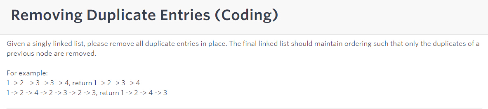
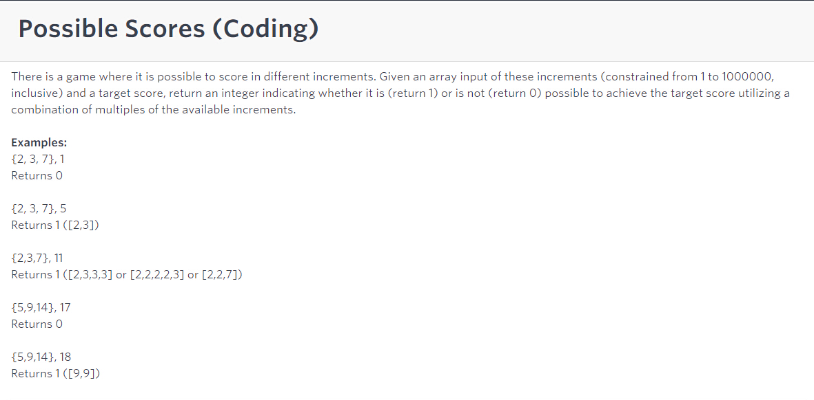
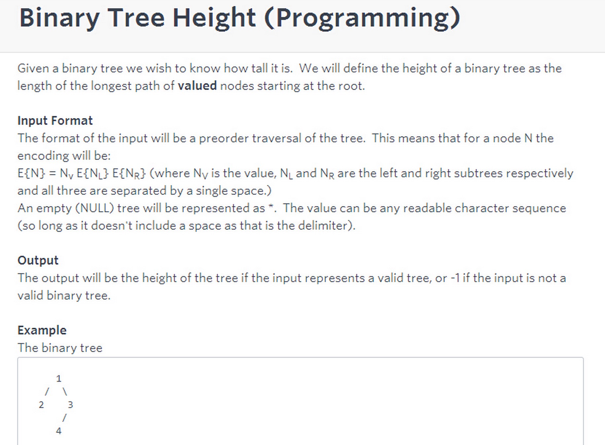
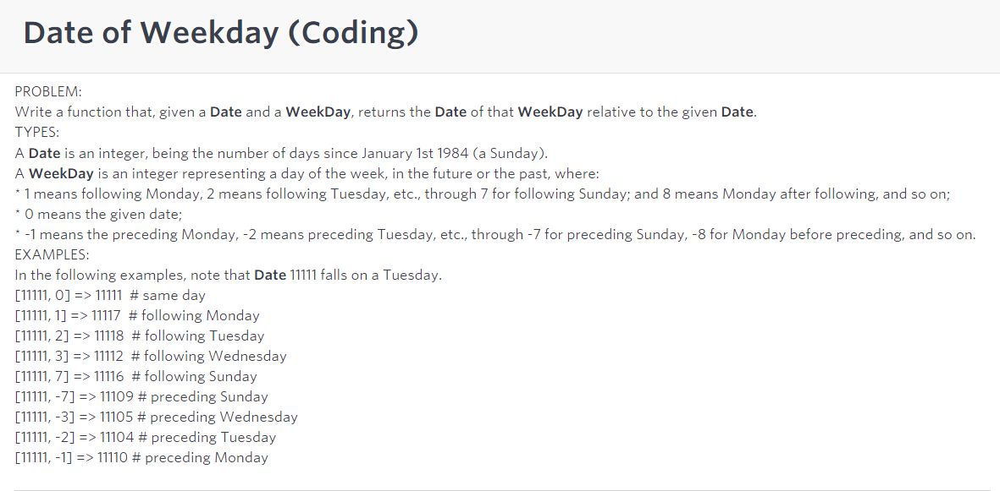
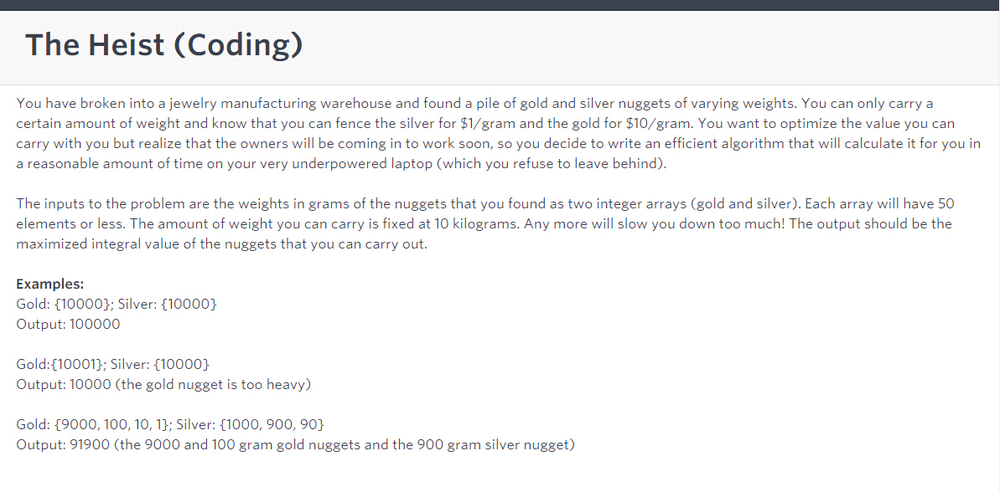

# VMware

从 OA 搞起

## 这一部分主要是 OA

> Removing Duplicate Entries



```java
static LinkedListNode removeDuplicates(LinkedListNode list) {
    LinkedListNode cur = list;
    HashSet<Integer> set = new HashSet<Integer>();
    set.add(list.val);
    while (cur.next != null) {
        if (!set.contains(cur.next.val)) {
            set.add(cur.next.val);
            cur = cur.next;
        }
        else {
            cur.next = cur.next.next;
        }
    }
    return list;
}
```

> Possible Scores



Combination Sum I 那道题的变体

```java
static int is_score_possible(int score, int[] increments) {
    Arrays.sort(increments);
    ArrayList<Integer> res = new ArrayList<Integer>();
    res.add(0);
    helper(res, increments, score, 0);
    return res.get(0);
}

public static void helper(ArrayList<Integer> res, int[] increments, int score, int start) {
    if (score < 0) return;
    if (score == 0) {
        res.set(0, 1);
        return;
    }
    for (int i=start; i<increments.length; i++) {
        if (i>start && increments[i] == increments[i-1]) continue;
        helper(res, increments, score-increments[i], i);
        if (res.get(0) == 1) return;
    }
}
```

> Binary Tree Height



这道题要观察，举个例子，1 2 * * 3 * 4  5 * * 6 7 * 8 * *， 用Stack，先序遍历，遇到数字就入栈，如果遇到 * *，说明栈顶节点是叶子节点，一条根到叶子的路径这时候就存在于栈之中，只要计算栈的size()，就知道当前这条路径的深度，树的height就是这些深度的最大值。

空格的引入增添了不少判断上的麻烦， 比如: ab * *, 这棵树的height是1 而不是2. 在遍历节点的时候需要注意取空格之前的所有元素一起看

第三遍办法：倒序读数组，用stack存。遇到“*”存入0，遇到数字，pop两次，取最大值+1，再push入栈

```java
public class Solution5 {
    public int treeHeight(String preorder) {
        if (preorder==null || preorder.length()==0) return -1;
        preorder.trim();
        if (preorder.length() == 0) return -1;
        String[] strs = preorder.split(" ");
        int len = strs.length;
        Stack<Integer> st = new Stack<Integer>();
        for (int i=len-1; i>=0; i--) {
            if (strs[i].length() == 0) return -1; // cases that input has two spaces, wrong input
            if (strs[i].equals("*")) {
                st.push(0);
            }
            else {
                if (st.size() == 0) return -1;
                int num1 = st.pop();
                if (st.size() == 0) return -1;
                int num2 = st.pop();
                st.push(Math.max(num1, num2) + 1);
            }
        }
        if (st.size() != 1) return -1;
        return st.peek();
    }

    public static void main (String[] args) {
        Solution5 a = new Solution5();
        int ret = a.treeHeight("a b * * *");
        System.out.println(ret);
    }
}
```

第二遍做法：仿效preorder traversal的iterative做法，用Stack, 因为有空格，先split(" "), 这样把它转化为array,且解决了上面ab * *的问题，

但是做OA的时候，大部分case过了，还是有小case过不了

```java
public class Solution {
   public int treeHeight(String preorder) {
       if (preorder==null || preorder.length()==0) return -1;
       preorder.trim();
       if (preorder.length() == 0) return -1;
       String[] ar = preorder.split(" ");
       Stack<String> st = new Stack<String>();
       int maxHeight = 0;
       int curHeight = 0;
       String root = ar[0];
       int i = 0;
       while (!root.equals("*") || !st.isEmpty()) {
           if (!root.equals("*")) { // not null
               st.push(root);
               curHeight++;      // this node's height
               maxHeight = Math.max(maxHeight, curHeight); //all time heighest
               root = ar[++i];   // next node in preorder tranversal
           }
           else {
               st.pop();
               if (ar[i-1].equals("*")) curHeight = st.size() + 1; //only a[i]=="*" && a[i-1]=="*", curheight will change
               root = ar[++i];
           }
       }
       if (i != ar.length) return -1; // if not reaching the end of the preorder array, then the tree is not valid
       return maxHeight;
   }
}
```

第21行比较tricky, 解释如下，如果遇到两个星的情况如**，表示遇到叶子节点了，pop操作之后，下一个节点（假设叫x）一定是某个节点（假设叫y）的第一个右节点，而且节点y已经不在stack里了，刚被pop掉，所以当前curHeight更新为 stack.size()+1, 这个1就是加上节点y的一层

> Date of Weekday



```java
import java.util.Scanner;


public class Solution2 {
    static int DateOfWeekday_2(int date, int weekday) {
        int cur = date % 7;
        int res;
        if (weekday == 0) return date;
        else if (weekday > 0) { 
            if (weekday % 7 > cur) res = date + weekday % 7 - cur;
            else res = date + 7 - (cur - weekday % 7);
            res = res + 7*((weekday-1)/7);
        }
        else {
            if (Math.abs(weekday % 7)<cur) res= date - cur - weekday % 7;
            else res = date - 7 - cur - weekday%7;
            res = res - 7*((Math.abs(weekday)-1)/7);
        }
        return res;
    }

    static int DateOfWeekday(int date, int weekday) {
        int cur = date%7;
        int res = 0;
        int dif = 0;
        if (weekday > 0) {
            dif = 7*((weekday-1)/7) + (weekday%7-cur>0? weekday%7-cur : 7-(cur-weekday%7));
            res = date + dif;
        }
        else if (weekday < 0){
            weekday = Math.abs(weekday);
            dif = 7*((weekday-1)/7) + (cur-weekday%7>0? cur-weekday%7 : 7-(weekday%7-cur));
            res = date - dif;
        }
        else res = date;
        return res;
    }
    
    public static void main(String[] args) {
        Scanner in = new Scanner(System.in);
        int res;
        int _date;
        _date = Integer.parseInt(in.nextLine());
        
        int _weekday;
        _weekday = Integer.parseInt(in.nextLine());
        
        res = DateOfWeekday(_date, _weekday);
        System.out.println(res);
    }
}
```

> The Heist



类似BackpackII问题

```java
static int maximize_loot(int[] gold, int[] silver) {
    int[][] res = new int[gold.length+silver.length+1][10001];
    res[0][0] = 0;
    for (int i=1; i<=gold.length; i++) {
        for (int j=0; j<=10000; j++) {
            res[i][j] = Math.max(res[i-1][j], (j>=gold[i-1]? res[i-1][j-gold[i-1]]+10*gold[i-1] : 0));
        }
    }
    for (int i=1; i<=silver.length; i++) {
        for (int j=0; j<=10000; j++) {
            res[i+gold.length][j] = Math.max(res[i+gold.length-1][j], (j>=silver[i-1]? res[i+gold.length-1][j-silver[i-1]]+1*silver[i-1] : 0));
        }
    }
    int maxVal = 0;
    for (int k=0; k<=10000; k++) {
        maxVal = Math.max(maxVal, res[gold.length+silver.length][k]);
    }
    return maxVal;

}
```

> Coin Toss Betting


```java
static int CoinTossEndAmount(int betAmount, String coinTossResults) {
    if (betAmount <=0 || coinTossResults.length() == 0) return betAmount;
    long Amount = betAmount;
    long onebet = 1;
    for (int i=0; i<coinTossResults.length(); i++) {
        if (coinTossResults.charAt(i) == 'H') {
            Amount += onebet;
            onebet *= 2;
        }
        else {
            Amount -= onebet;
            onebet /= 2;
        }
        if (Amount < onebet) return 0;
        if (onebet < 1) onebet = 1;
    }
    return (int)Amount;
}
```

> Flip Bit to Win

见 3.7.3